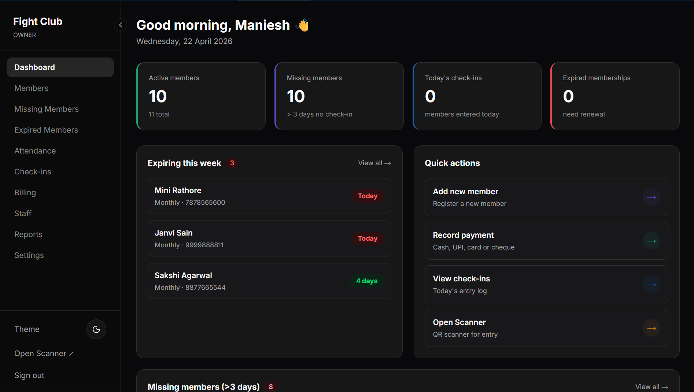

# 🏋️‍♂️ Gym Management System

A comprehensive, role-based gym management solution built with modern web technologies to streamline operations, member tracking, and trainer management.

[](https://fightclub.manieshsanwal.in)
[](https://nextjs.org/)
[](https://www.prisma.io/)
[](https://tailwindcss.com/)

## 🚀 Live Preview



**Live URL:** [https://fightclub.manieshsanwal.in](https://fightclub.manieshsanwal.in)

---

## ✨ Features

- **🛡️ Role-Based Access Control (RBAC)**: Fine-grained permissions for Owners, Trainers, and Receptionists.
- **📱 QR Code Check-ins**: Seamless member check-in process using generated QR codes.
- **📊 Real-time Analytics**: Insights into gym performance, member attendance, and revenue.
- **💳 Payment Management**: Track payments, manage plans, and generate digital receipts.
- **📄 PDF Generation**: Professional receipt and report generation.
- **🌗 Dark Mode Support**: Sleek, modern UI with theme customization.

---

## 🛠️ Tech Stack

### Frontend & Framework
- **Next.js 15+**: React framework for production (App Router).
- **TypeScript**: Static typing for robust code.
- **Tailwind CSS**: Utility-first CSS framework for custom design.
- **Shadcn/UI**: Beautifully designed components built with Radix UI.
- **Lucide React**: Clean and consistent icon library.
- **Framer Motion**: Smooth animations and transitions.

### Backend & Database
- **PostgreSQL**: Industry-standard relational database.
- **Neon DB**: Serverless Postgres for scalability.
- **Prisma**: Type-safe ORM for database management.
- **NextAuth.js v5**: Secure authentication and session management.

### Libraries & Tools
- **React Hook Form**: Performant, flexible forms.
- **Zod**: TypeScript-first schema validation.
- **Recharts**: Composant-based charting library.
- **React PDF**: Generate PDF documents on the fly.
- **Date-fns**: Modern JavaScript date utility library.
- **QR Code**: Generation and scanning capabilities.

---

## 👥 Role Descriptions

The system is designed with three distinct roles to ensure optimized workflows:

| Role | Responsibilities |
| :--- | :--- |
| **Owner** | Full system access, staff management, financial reports, and gym settings. |
| **Reception** | Member registration, payment collection, and daily check-in management. |
| **Trainer** | Manage assigned members, track attendance, and view training schedules. |

---

## 🛠️ Getting Started

### Prerequisites
- Node.js 18+
- PostgreSQL database (or Neon account)

### Installation

1. **Clone the repository**
   ```bash
   git clone https://github.com/Maniesh-dev/gym-management.git
   cd gym-management
   ```

2. **Install dependencies**
   ```bash
   npm install
   ```

3. **Environment Setup**
   Create a `.env.local` file and add your configuration (see `.env.example`).
   ```env
   DATABASE_URL="your_postgres_url"
   AUTH_SECRET="your_nextauth_secret"
   ```

4. **Database Setup**
   ```bash
   npx prisma generate
   npx prisma db push
   ```

5. **Run the development server**
   ```bash
   npm run dev
   ```

Visit [http://localhost:3000](http://localhost:3000) to see your app in action!

---

Developed with ❤️ by [Maniesh Sanwal](https://github.com/Maniesh-dev)
